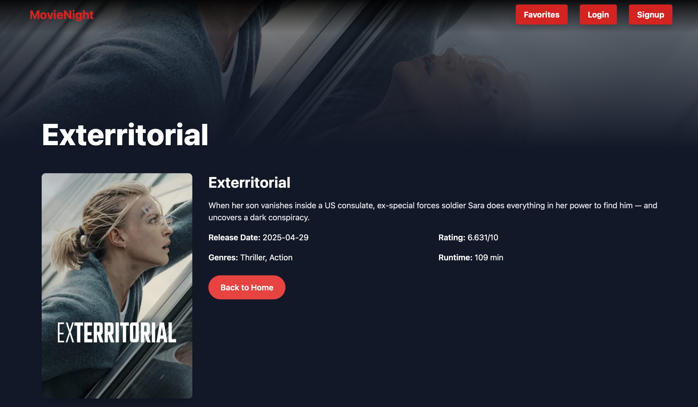
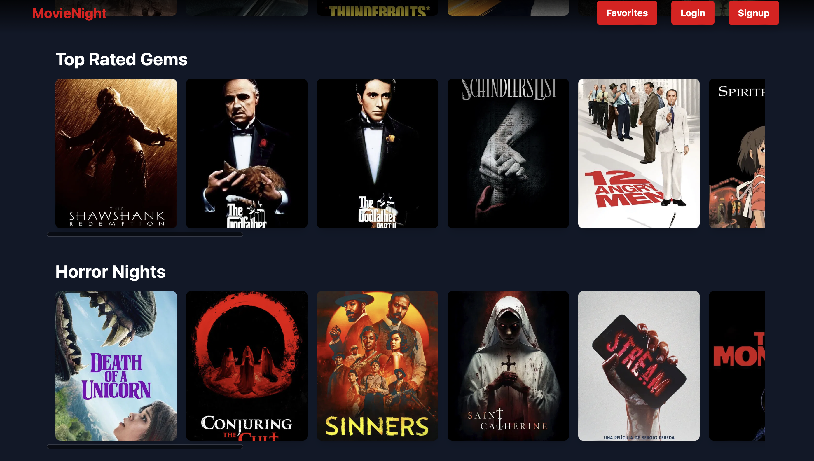

# 🎥 Movie Night - A Netflix-Inspired React App

This is a Netflix-style movie browsing application built with **React**, **Framer Motion**, and **Tailwind CSS**, using data from the **TMDB API**.

## 🚀 Features

- 🌐 Browse movies by categories: Popular, Top Rated, Horror, Sci-Fi, Comedy, and Action
- 🔍 Search for movies using the TMDB API
- 🎨 Toggle between Dark and Light mode
- 🎬 Beautiful animations with Framer Motion
- 📦 Organized code structure with reusable components

## 📸 Preview

 

 

 

## 🛠️ Tech Stack

- React
- Tailwind CSS
- Framer Motion
- TMDB API

